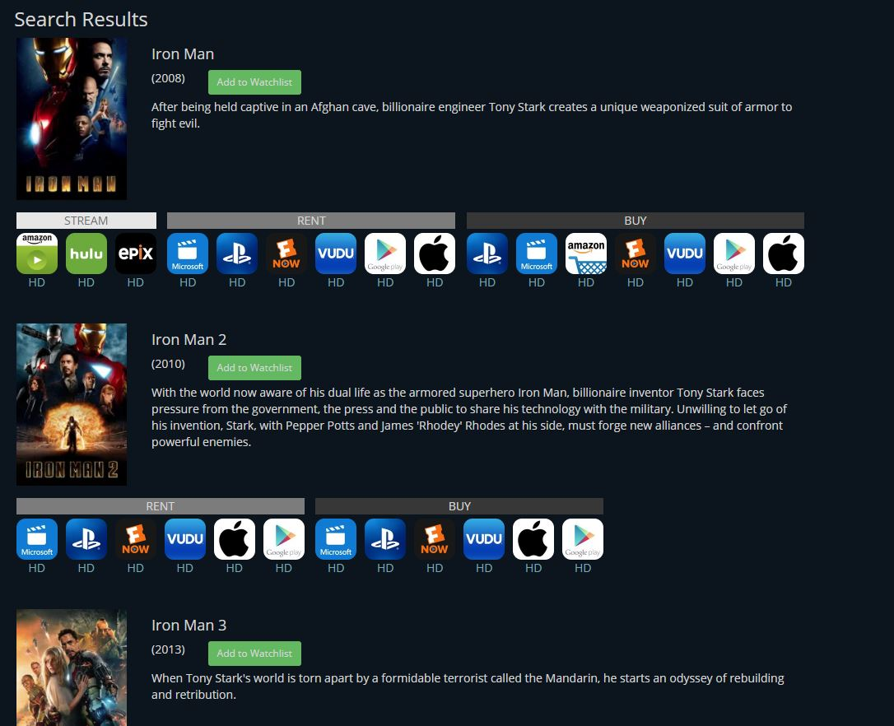

# Stream Search
Stream Search is a website that tells you how to watch your favorite tv shows or movies online. Simply search for the title you want to watch, and a list of relevant matches will be returned. You can then choose the streaming, rental, or purchase option of your choice and enjoy the film. 

## Technologies Used
This website was created using JustWatch.com's API which allows access to their robust database. This app also uses the following technologies:
* HTML
* CSS
* JavaScript
* jQuery
* Node.js
* Express
* MongoDB
* Mongoose
* Mocha
* Chai

### Create Your Own Watchlist
If you found the movie or show you were looking for, but aren't ready to start watching, you can add the title to your watchlist. Keep searching for some more titles you would want to watch and build up your watchlist. Simply return to your dashboard to see your list. You will see your watchlist every time you log on to the site. 

### Search Other User's Watchlist
If you've run out of ideas of things to watch, you can always search for a friend's watchlist. See what they have listed and add a title you like to your own list.

